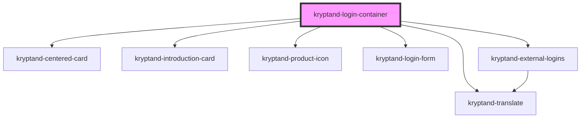

# kryptand-login-container

<!-- Auto Generated Below -->

## Properties

| Property | Attribute | Description | Type                | Default     |
| -------- | --------- | ----------- | ------------------- | ----------- |
| `theme`  | `theme`   |             | `"dark" \| "light"` | `undefined` |

## Dependencies

### Depends on

- [kryptand-centered-card](../../../../shared/ui/src/components/centered-card)
- [kryptand-introduction-card](../../../../shared/ui/src/components/introduction-card)
- [kryptand-product-icon](../../../../shared/ui/src/components/product-icon)
- kryptand-translate
- [kryptand-login-form](../login-form)
- [kryptand-external-logins](../../../../shared/ui/src/components/external-logins)

### Graph

----------------------------------------------

*Built with [StencilJS](https://stenciljs.com/)*
