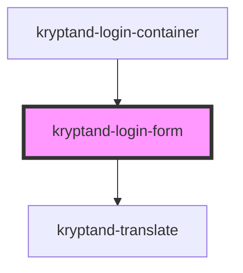

# kryptand-login-form

<!-- Auto Generated Below -->

## Events

| Event        | Description | Type                                                |
| ------------ | ----------- | --------------------------------------------------- |
| `formSubmit` |             | `CustomEvent<{ email: string; password: string; }>` |

## Dependencies

### Used by

 - [kryptand-login-container](../login-container)

### Depends on

- kryptand-translate

### Graph

----------------------------------------------

*Built with [StencilJS](https://stenciljs.com/)*
