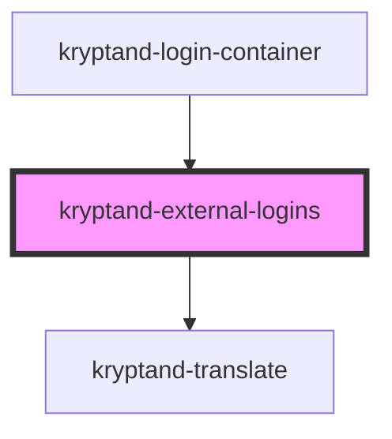

# kryptand-external-logins

<!-- Auto Generated Below -->

## Events

| Event                   | Description | Type               |
| ----------------------- | ----------- | ------------------ |
| `facebookButtonClicked` |             | `CustomEvent<any>` |
| `githubButtonClicked`   |             | `CustomEvent<any>` |
| `googleButtonClicked`   |             | `CustomEvent<any>` |
| `twitterButtonClicked`  |             | `CustomEvent<any>` |

## Dependencies

### Used by

 - [kryptand-login-container](../../../../../feature-login/src/components/login-container)

### Depends on

- kryptand-translate

### Graph

----------------------------------------------

*Built with [StencilJS](https://stenciljs.com/)*
