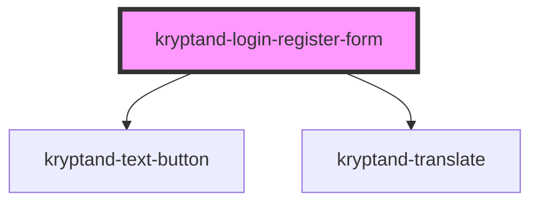

# kryptand-login-register-form

<!-- Auto Generated Below -->

## Properties

| Property      | Attribute      | Description | Type     | Default     |
| ------------- | -------------- | ----------- | -------- | ----------- |
| `buttonLabel` | `button-label` |             | `string` | `undefined` |

## Events

| Event        | Description | Type                                                |
| ------------ | ----------- | --------------------------------------------------- |
| `formSubmit` |             | `CustomEvent<{ email: string; password: string; }>` |

## Dependencies

### Depends on

- [kryptand-text-button](../text-button)
- kryptand-translate

### Graph

----------------------------------------------

*Built with [StencilJS](https://stenciljs.com/)*
